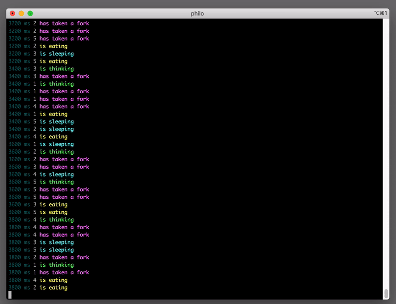

<h1 align="center">Philosophers</h1>

A project which solves the philosophers problem with threads and mutexes

<h2 align="center">Usage</h2>

go to the directory type <b> make </b> 

 <b> execute </b> ./philo [number of philos < 200] [time_to_die] [time_to_eat] [time_to_sleep] [number_of_times_each_philo_must_eat]\n last argument is optional
